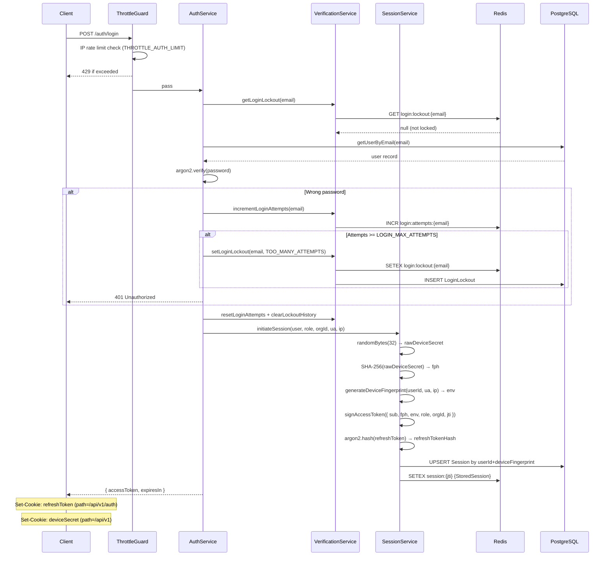
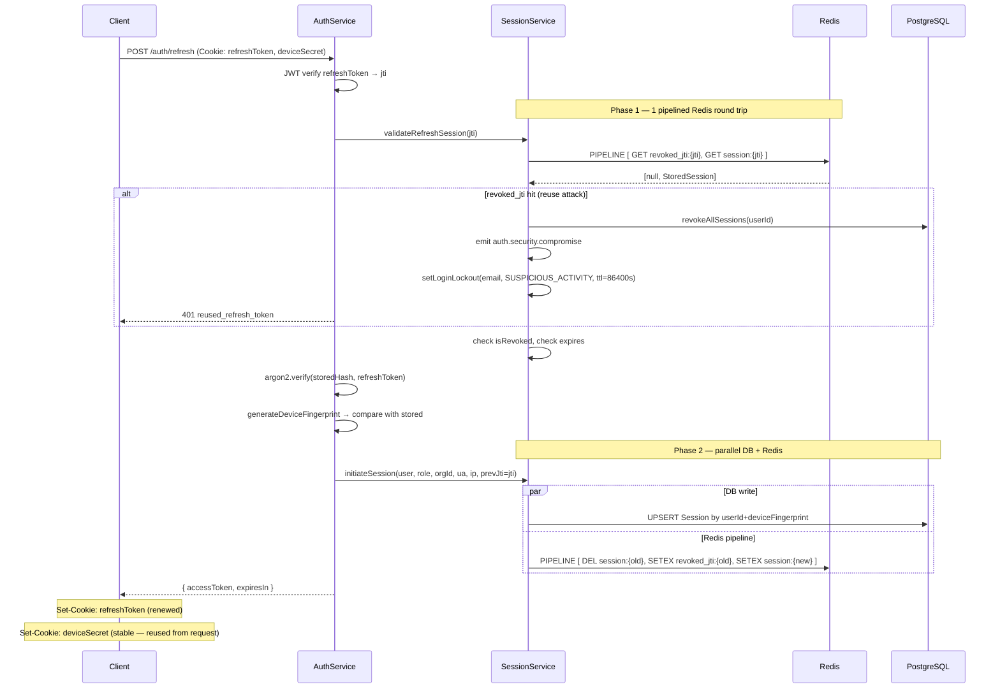
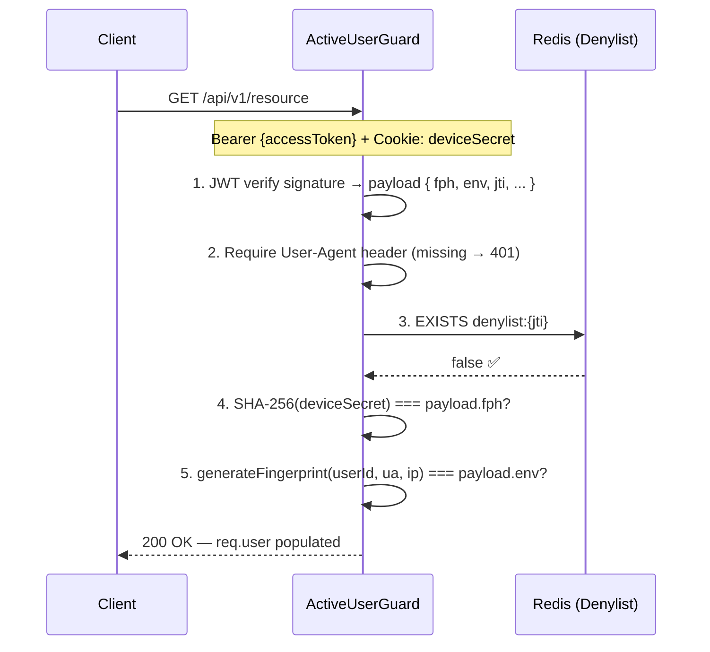
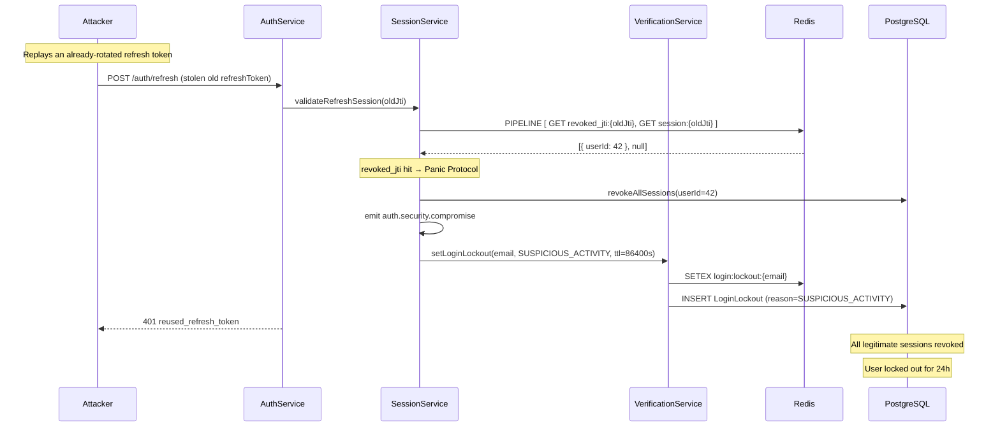
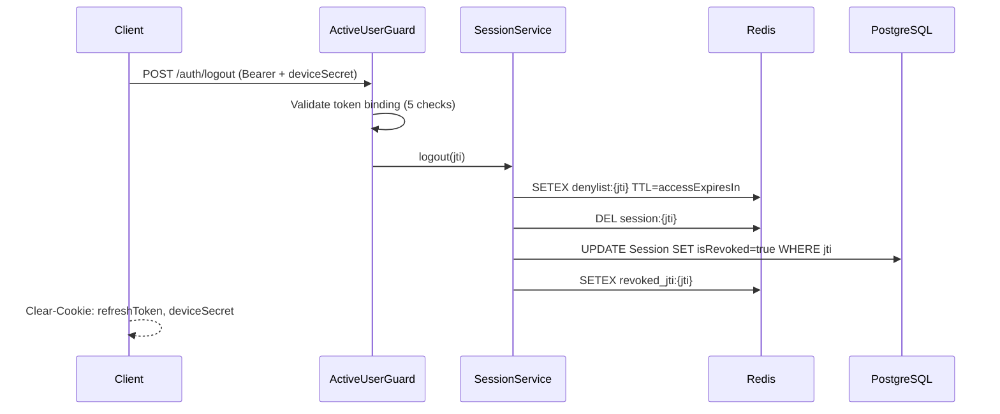

# Authentication Architecture — Zero-Trust & Split-Token Binding

## 1. Executive Overview

Rufieltics API implements a **Hybrid Zero-Trust Authentication** model combining:

- **Stateless** JWT access tokens for ultra-fast per-request verification
- **Stateful** Redis + PostgreSQL sessions for revocation, reuse detection, and security audit
- **Split-Token Proof-of-Possession** (DPoP-Lite) that physically binds tokens to the device that created them
- **Progressive account-level lockout** on top of IP-level rate limiting

The architecture is designed to sustain **millions of concurrent users** without degrading database or cache performance — specifically by minimizing I/O on the hot paths (every request, every refresh).

---

## 2. Why This Architecture?

### The Problem with Standard JWT

Standard JWT implementations are vulnerable to **XSS Token Exfiltration**. If an attacker injects malicious JavaScript, they can steal a Bearer token and replay it from any machine.

### The Solution: Three-Layer Token Binding

| Layer                        | What It Checks                       | How                                                           |
| ---------------------------- | ------------------------------------ | ------------------------------------------------------------- |
| **Cryptographic Possession** | You hold the original `deviceSecret` | SHA-256(`deviceSecret`) must match `fph` claim in JWT         |
| **Environmental Integrity**  | Same device/location as login        | `hash(userId + UA + country + region)` must match `env` claim |
| **Revocation**               | Token hasn't been revoked/logged out | Redis denylist check per JTI (TTL = access token lifespan)    |

An attacker who steals only the Bearer token cannot pass check:

1. They don't have the `deviceSecret` cookie (HttpOnly, same-site). An attacker who steals both the token and the cookie still fails check
2. If they're in a different country, browser, or OS.

---

## 3. Cookie Strategy

Two separate cookies are issued on login and refresh:

| Cookie         | Path           | Purpose                                                                                         |
| -------------- | -------------- | ----------------------------------------------------------------------------------------------- |
| `refreshToken` | `/api/v1/auth` | Only sent to the refresh endpoint. Limits exposure surface.                                     |
| `deviceSecret` | `/api/v1`      | Sent to all API routes. Scoped broadly so all authenticated endpoints can verify token binding. |

> Both are `HttpOnly`, `SameSite: Strict`, and `Secure` in production. `SameSite: Strict` mitigates CSRF on its own; the narrow path on `refreshToken` adds a secondary defense.

---

## 4. Security Layers

### 4.1 IP-Level Rate Limiting (Throttle Guard)

The `I18nThrottlerGuard` fires **before** the controller on `POST /auth/login`. It limits attempts per IP using a sliding window (configured via `THROTTLE_AUTH_LIMIT` and `THROTTLE_AUTH_TTL`). When the limit is reached, the client receives `429 Too Many Requests`.

### 4.2 Account-Level Lockout (Login Lockout)

Separate from IP throttling, `VerificationService` tracks failed login attempts **per email address** in Redis. The limit is set to `THROTTLE_AUTH_LIMIT × 2` so it only activates after the IP throttle has already fired — preventing the two defenses from producing conflicting error messages.

On lockout, a `LoginLockout` record is written to PostgreSQL. Duration escalates progressively for repeat offenders:

| Offence Count | Duration   |
| ------------- | ---------- |
| 1st lockout   | 30 minutes |
| 2nd lockout   | 2 hours    |
| 3rd lockout   | 12 hours   |
| 4th+ lockout  | 24 hours   |

Lockout history for **legitimate users** is cleared on successful login (`clearLoginLockoutHistory`). For attackers, history persists because the lock is never voluntarily cleared.

### 4.3 Lockout Reasons

Three lockout reasons exist. Each may be applied by a different trigger:

| Reason                | Trigger                                       | TTL                            |
| --------------------- | --------------------------------------------- | ------------------------------ |
| `TOO_MANY_ATTEMPTS`   | Automatic after N failed passwords            | Progressive (30 min → 24 h)    |
| `SUSPICIOUS_ACTIVITY` | Refresh token reuse detected (Panic Protocol) | Always 24 hours (max step)     |
| `MANUAL_LOCK`         | Admin POST `/admin/login-lockouts`            | Admin-specified or progressive |

### 4.4 Verification Lockout (Email Verification)

A separate lockout exists for email verification codes (`VerificationLockout`). It uses atomic Redis `INCR` for attempt counting (no read-modify-write race) and a separate key from the code itself, making both independently TTL-managed.

### 4.5 Single-Use Refresh Token Rotation (Panic Protocol)

Every refresh token is single-use. On rotation:

1. The old JTI is written to `revoked_jti:{jti}` in Redis (TTL = refresh token lifespan).
2. If the same refresh token is presented again, this key is found and the **Panic Protocol** fires: all sessions for that user are immediately revoked and a `SUSPICIOUS_ACTIVITY` login lockout is applied.

---

## 5. Optimized Refresh Token Flow

> **Design goal**: sustain 1 M+ users refreshing every 15 minutes (~1,100 req/sec) without degrading PostgreSQL.

### 5.1 What Was Removed and Why

| Removed Operation                                 | Why It Was Redundant                                                        | Security Impact                                                                    |
| ------------------------------------------------- | --------------------------------------------------------------------------- | ---------------------------------------------------------------------------------- |
| `Sessions.revokeByJti` (DB UPDATE)                | `upsertByFingerprint` immediately overwrites the same row                   | None — old JTI tracked in `revoked_jti:` Redis key                                 |
| `getUserById` on refresh                          | Only needed `id`, `email`, `isStaff`; now cached in `StoredSession`         | None — staleness window ≤ 1 refresh cycle (15 min); admin revocation clears caches |
| `Sessions.findByFingerprint` on `initiateSession` | Always found the row about to be upserted; used only to clear old JTI cache | None — caller passes `previousJti` directly                                        |
| `deleteExpiredByUserId` on login                  | Daily cron (`SessionCleanupService`) already handles cleanup                | None — expired sessions rejected by expiry check in refresh flow                   |

### 5.2 I/O Comparison

| Metric                        | Before         | After               |
| ----------------------------- | -------------- | ------------------- |
| DB reads per refresh          | 2              | **0** (happy path)  |
| DB writes per refresh         | 2              | **1** (upsert only) |
| Redis round trips per refresh | 5 (sequential) | **2** (pipelined)   |
| Total network hops            | 9              | **3**               |

Cache miss (Redis eviction / cold start) adds 2 DB reads as fallback. This is rare in steady state.

### 5.3 StoredSession Cache Shape

`session:{jti}` in Redis now carries all fields needed to refresh without touching PostgreSQL or the User table:

```typescript
interface StoredSession {
  userId: number
  email: string
  isStaff: boolean
  refreshTokenHash: string
  isRevoked: boolean
  expires: string
  role: string | null
  orgId: string | null
  deviceFingerprint: string
}
```

**Backward compatibility**: sessions cached before this change lack `email`/`isStaff`. The refresh path detects their absence and falls back to `getUserForSession(userId)` — a minimal 3-column query with no JOINs. This self-heals as sessions rotate.

### 5.4 Optimized Refresh Flow (Step by Step)

```
1.  JWT verify refreshToken → extract jti                   [CPU ~1ms]

2.  Redis PIPELINE (1 round trip):
      GET revoked_jti:{jti}    → reuse detection
      GET session:{jti}        → session data

3.  If revoked_jti hit:
      → revokeAllSessions(userId)                           [DB updateMany]
      → emit auth.security.compromise
      → apply SUSPICIOUS_ACTIVITY lockout
      → throw 401

4.  If session:{jti} hit (happy path):
      Extract userId, email, isStaff, refreshTokenHash,
      role, orgId, deviceFingerprint, expires, isRevoked
      Check isRevoked → throw if true
      Check expires   → throw if expired
    Else (cache miss — rare):
      DB SELECT Session WHERE jti                           [1 DB read]
      DB SELECT getUserForSession(userId)                   [1 DB read]

5.  argon2.verify(storedHash, refreshToken)                 [CPU ~100-300ms]

6.  generateDeviceFingerprint(userId, userAgent, ipAddress) [CPU ~1ms]
      Compare with storedFingerprint
      Mismatch → revoke by JTI + throw 401

7.  Parallel (Promise.all):
    a. DB UPSERT Session by userId+deviceFingerprint        [1 DB write]
    b. Redis PIPELINE (1 round trip):
         DEL  session:{oldJti}
         SETEX revoked_jti:{oldJti}  TTL=refreshTtl
         SETEX session:{newJti}      TTL=refreshTtl

8.  Sign new accessToken + return
      Set-Cookie: refreshToken (path /api/v1/auth)
      Set-Cookie: deviceSecret  (path /api/v1)
```

---

## 6. Security Flow Diagrams

### 6.1 Login & Session Initiation



### 6.2 Token Refresh (Optimized)



### 6.3 Protected API Request (ActiveUserGuard)



### 6.4 Panic Protocol (Token Reuse)



### 6.5 Logout & Revocation



---

## 7. Performance Engineering

### 7.1 ActiveUserGuard — Per Request Cost

The guard runs on every authenticated request. It is **100% stateless** except for the Redis denylist check.

| Operation                 | Cost       | Notes           |
| ------------------------- | ---------- | --------------- |
| JWT signature verify      | ~0.1ms     | CPU only        |
| User-Agent presence check | ~0ms       | Header presence |
| Redis EXISTS denylist     | ~0.3ms     | 1 network hop   |
| SHA-256 deviceSecret      | ~0.1ms     | CPU only        |
| Device fingerprint hash   | ~0.1ms     | CPU only        |
| **Total per request**     | **~0.6ms** | No DB touch     |

### 7.2 Refresh Token — Per Rotation Cost

| Operation                  | Cost           | Notes                             |
| -------------------------- | -------------- | --------------------------------- |
| JWT verify (refresh token) | ~0.1ms         | CPU only                          |
| Redis pipeline GET × 2     | ~0.5ms         | 1 round trip                      |
| argon2.verify              | ~100–300ms     | CPU, intentionally slow           |
| Device fingerprint hash    | ~0.1ms         | CPU only                          |
| argon2.hash (new token)    | ~100–300ms     | CPU, intentionally slow           |
| Redis pipeline write × 3   | ~0.5ms         | 1 round trip, parallel with DB    |
| DB UPSERT Session          | ~2–5ms         | 1 round trip, parallel with Redis |
| **Total**                  | **~205–610ms** | Dominated by argon2 (necessary)   |

> Argon2 is intentionally expensive (timeCost=3, memoryCost=64MB) to resist offline brute-force on stolen hashes. The rest of the refresh path adds only ~6ms overhead.

### 7.3 Scale Projection

| Users | Refreshes/sec | DB writes/sec | Redis round trips/sec |
| ----- | ------------- | ------------- | --------------------- |
| 100k  | ~111          | ~111          | ~222                  |
| 500k  | ~556          | ~556          | ~1,112                |
| 1M    | ~1,111        | ~1,111        | ~2,222                |
| 5M    | ~5,556        | ~5,556        | ~11,112               |

A single PostgreSQL instance with connection pooling handles ~10,000–20,000 simple write queries/sec. Redis handles ~100,000+ ops/sec. The bottleneck at scale is argon2 CPU throughput — horizontal scaling of API nodes addresses this directly.

---

## 8. Account Lockout Reference

### 8.1 Admin Endpoints

| Method   | Path                        | Purpose                                    |
| -------- | --------------------------- | ------------------------------------------ |
| `GET`    | `/admin/lockouts`           | List verification lockouts                 |
| `GET`    | `/admin/lockouts/:id`       | Get verification lockout by ID             |
| `DELETE` | `/admin/lockouts/:id`       | Clear verification lockout (manual unlock) |
| `POST`   | `/admin/login-lockouts`     | Apply MANUAL_LOCK to an account            |
| `GET`    | `/admin/login-lockouts`     | List login lockouts                        |
| `GET`    | `/admin/login-lockouts/:id` | Get login lockout by ID                    |
| `DELETE` | `/admin/login-lockouts/:id` | Clear login lockout (manual unlock)        |

### 8.2 Redis Key Reference

| Key Pattern                           | TTL     | Purpose                                    |
| ------------------------------------- | ------- | ------------------------------------------ |
| `session:{jti}`                       | 7 days  | Full session cache (StoredSession)         |
| `revoked_jti:{jti}`                   | 7 days  | Reuse detection — set on every rotation    |
| `denylist:{jti}`                      | 5 min   | Access token revocation (logout/revoke)    |
| `login:lockout:{email}`               | Dynamic | Account-level login lockout                |
| `login:attempts:{email}`              | 15 min  | Failed login attempt counter               |
| `verification:email:{email}`          | 5 min   | Email verification code                    |
| `verification:email:{email}:attempts` | 5 min   | Verification attempt counter (atomic INCR) |

---

## 9. Auditability & Observability

Every authentication event is tracked for security analytics:

| Event                | Storage                          | What Is Recorded                                          |
| -------------------- | -------------------------------- | --------------------------------------------------------- |
| Successful login     | `LoginLog` (DB)                  | userId, IP, User-Agent, city, country, lat/lng            |
| Failed login         | Redis counter                    | email, attempt count (no PII stored)                      |
| Login lockout        | `LoginLockout` (DB)              | email, reason, IP, User-Agent, expires, clearedBy         |
| Verification lockout | `VerificationLockout` (DB)       | email, reason, expires, clearedBy                         |
| Token reuse          | `auth.security.compromise` event | All sessions revoked, SUSPICIOUS_ACTIVITY lockout applied |
| Session revocation   | `Session.isRevoked` (DB)         | jti, timestamp                                            |

The `auth.security.compromise` event is emitted on both refresh token reuse and access to an already-revoked session. It triggers immediate full revocation and the 24-hour login lockout.
