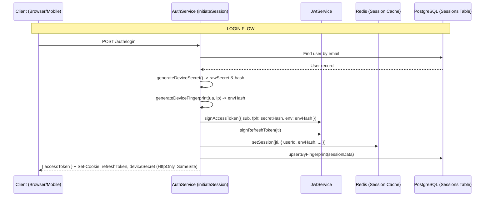
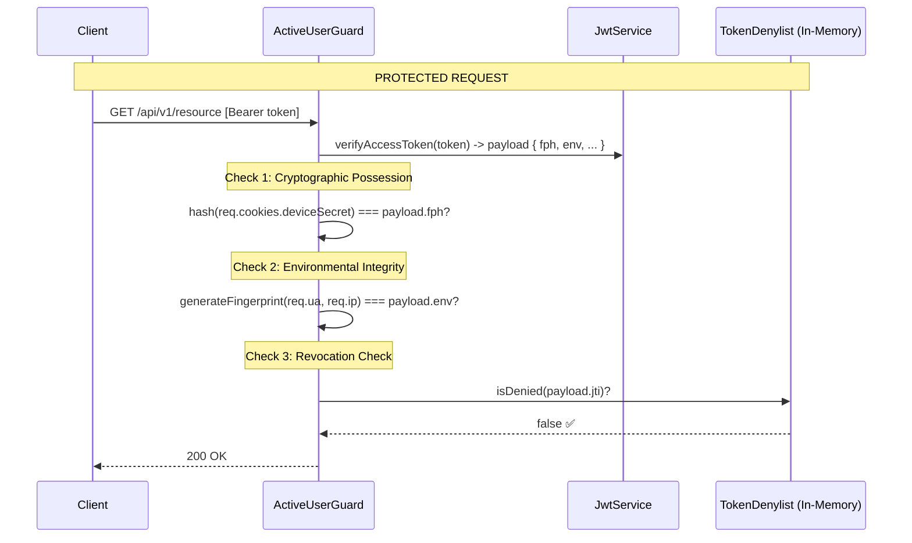

# Authentication Architecture — Zero-Trust & Split-Token Binding

## 1. Executive Overview

Rufieltics API implements a **Hybrid Zero-Trust Authentication** model. It combines the massive horizontal scalability of stateless JSON Web Tokens (JWT) with the ironclad security of stateful sessions (Redis/PostgreSQL).

The core innovation is **Split-Token Proof-of-Possession** (DPoP-Lite), which physically separates a session's cryptographic keys across two independent storage layers: the Application Memory (Bearer Token) and the Browser's Protected Cookie Jar (HttpOnly `deviceSecret`).

---

## 2. The Rationale: Why I use this architecture?

Standard JWT implementations are vulnerable to **XSS Token Exfiltration**. If a hacker injects malicious JavaScript, they can steal the Bearer Token and use it from their own machine.

### My Solution:

1.  **Dual-Key Binding**: I issue an `accessToken` (Bearer) and a `deviceSecret` (HttpOnly Cookie). The API Guard strictly requires **both** to match mathematically.
2.  **Environment Anchoring**: Every token is "anchored" to its originating environment (User-Agent + GeoIP Region). Stolen tokens instantly self-destruct if used from a different location or browser.
3.  **Single-Use Rotation**: Refresh Tokens are single-use. Any attempt to reuse an old token triggers the **Panic Protocol**, which immediately revokes _every_ session for that user.

---

## 3. Scalability Analysis

### A. Horizontal Scaling (The "Hot Path")

The `ActiveUserGuard` (the most frequently hit part of the API) is **100% Stateless**.

- It does **not** perform a database lookup.
- It does **not** perform a Redis lookup (except once per 15 minutes for the denylist check).
- This allows me to scale my API instances up to thousands of nodes without bottlenecking my database or cache. Each node can verify requests in complete isolation.

### B. Stateful Persistence (The "Auth Path")

Persistence (Redis/DB) is reserved exclusively for the "expensive" authentication events:

- `POST /auth/login`: Occurs once per user session.
- `POST /auth/refresh`: Occurs once every 15-60 minutes.
- `POST /auth/logout`: Occurs once per session end.

By offloading 99% of traffic to the stateless Guard, the system maintains ultra-low latency even under massive concurrent load.

---

## 4. Performance Engineering

I have engineered the `ActiveUserGuard` to minimize the "Security Tax" on every request.

| Operation                | Performance | Implementation                              |
| :----------------------- | :---------- | :------------------------------------------ |
| **JWT Verification**     | ~0.1ms      | RSA/ECDSA Signature Check (Stateless)       |
| **Denylist Check**       | ~0.001ms    | In-process Hash Map Lookup                  |
| **Cryptographic Verify** | ~0.2ms      | SHA-256 Hash Comparison (`deviceSecret`)    |
| **Fingerprint Sync**     | ~0.3ms      | Environmental Hash Computation (`UA + Geo`) |
| **TOTAL OVERHEAD**       | **~0.6ms**  | Per protected request.                      |

_(Note: 0.6ms is imperceptible to users, but provides absolute protection against session hijacking.)_

---

## 5. Security Flow Diagrams

### A. Login & Session Initiation

### B. Protected API Request (The Guard)

---

## 6. Auditability & Observability

Every authentication event is tracked for security analytics:

- **LoginHistory**: Database audit log of every successful or failed login attempt (including IP and GeoIP).
- **SecurityCompromiseEvent**: Triggered when token reuse or fingerprint mismatch is detected.
- **Real-time Revocation**: Users can view and revoke specific JTIs from their "Security" page.
