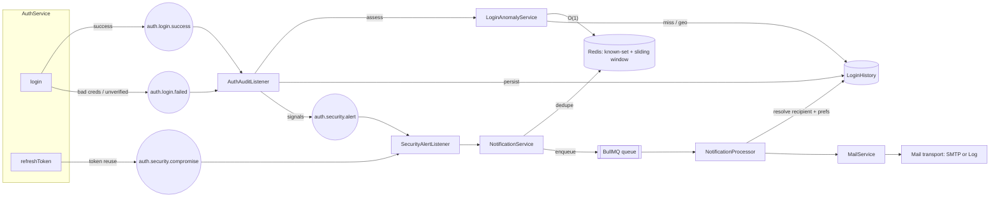
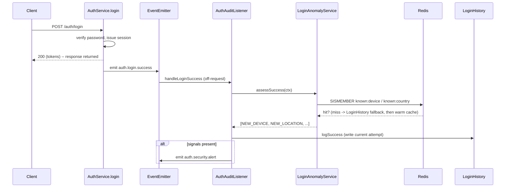
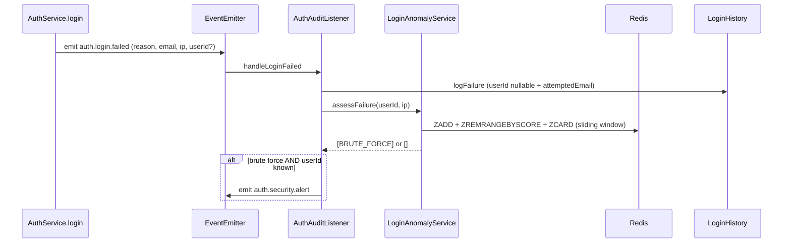
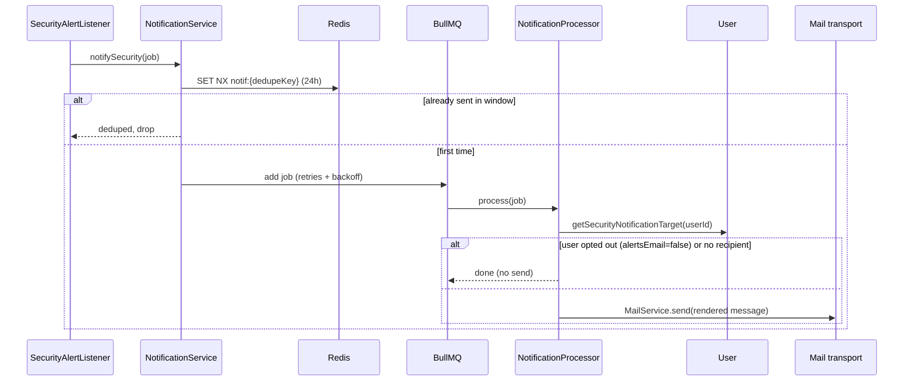
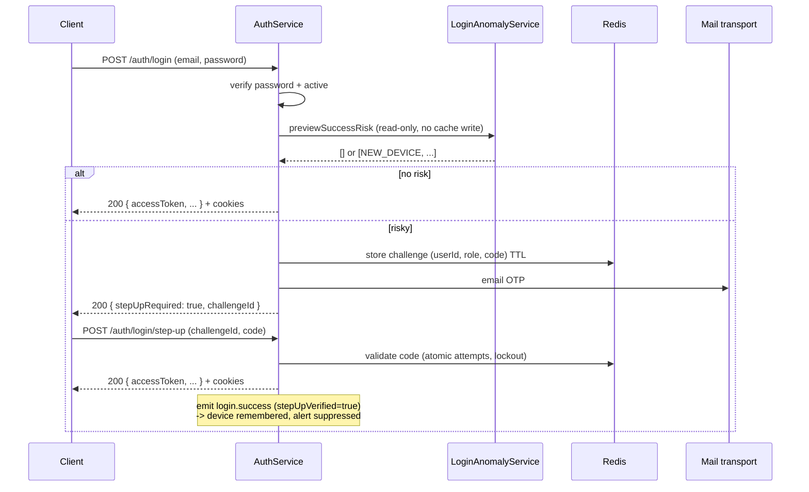

# Security & Login Monitoring

Detection and notification for suspicious authentication activity -- new device,
new country, impossible travel, brute force, and refresh-token reuse. This
document describes the design, the data model, the event flow, the delivery
pipeline, and the scaling characteristics.

## Status

| Phase | Scope                                                           | Status      |
| ----- | --------------------------------------------------------------- | ----------- |
| **1** | Failure logging + anomaly detection + structured alert logs     | Implemented |
| **2** | Notification pipeline (dedupe, user prefs, pluggable transport) | Implemented |
| **3** | Durable delivery queue (BullMQ on Redis) + SMTP transport       | Implemented |

All three phases are implemented. The only production step left is supplying
real SMTP credentials (`SMTP_HOST`, ...) -- without them the pipeline runs
end-to-end using a log-only transport.

## Principles

1. **Separate concerns** -- _detect_ (auth-specific) then _decide/notify_
   (channel-agnostic) then _deliver_ (transport). Each is independently testable
   and swappable.
2. **Never block login** -- detection and delivery run off an emitted event,
   after the HTTP response. A failure in monitoring can never fail auth.
3. **Cheap at volume** -- brute-force counting is a Redis sliding window (not a
   growing `count(*)`), "known device/country" is an O(1) Redis set lookup, and
   delivery is offloaded to a durable BullMQ queue so the request-adjacent path
   only dedupes and enqueues.
4. **Enumeration-safe** -- failed attempts for unknown emails are recorded for
   IP-based brute-force detection but never trigger a notification, which would
   leak whether an email is registered.

## Architecture



### Success path (detection ordering)

Detection must run **before** the current attempt is written, otherwise "new
device / new country" would match the row just inserted.



### Failure path



### Delivery path



## Detection rules

Computed by
[`LoginAnomalyService`](../src/features/auth/services/login-anomaly.service.ts).

| Signal              | Trigger                                                    | On      | Backing store           |
| ------------------- | ---------------------------------------------------------- | ------- | ----------------------- |
| `NEW_DEVICE`        | device fingerprint never seen in a successful login        | success | Redis set (DB fallback) |
| `NEW_LOCATION`      | GeoIP country never seen in a successful login             | success | Redis set (DB fallback) |
| `IMPOSSIBLE_TRAVEL` | last geo-tagged login implies > 900 km/h (min 50 km apart) | success | LoginHistory            |
| `BRUTE_FORCE`       | >= 5 failures for the user or IP within 15 minutes         | failure | Redis sliding window    |

Thresholds (`BRUTE_FORCE_THRESHOLD`, `BRUTE_FORCE_WINDOW_SECONDS`,
`MAX_TRAVEL_KMH`) are constants in the service and can be promoted to config
when tuning is needed.

> The device fingerprint is the same `userId:browser:os` hash used for token
> binding. Geo is deliberately not part of the binding hash (so network changes
> don't force re-login), but it is recorded and used for `NEW_LOCATION` /
> `IMPOSSIBLE_TRAVEL`.

## Events

| Event                      | Emitted by          | Payload                                 | Handled by              |
| -------------------------- | ------------------- | --------------------------------------- | ----------------------- |
| `auth.login.success`       | `login()`           | userId, ip, ua, deviceFingerprint, geo  | `AuthAuditListener`     |
| `auth.login.failed`        | `login()`           | reason, attemptedEmail, ip, ua, userId? | `AuthAuditListener`     |
| `auth.security.alert`      | `AuthAuditListener` | userId, signals[], context              | `SecurityAlertListener` |
| `auth.security.compromise` | `refreshToken()`    | userId, ip, ua                          | `SecurityAlertListener` |
| `auth.stepup.verified`     | `verifyStepUp()`    | userId, ip, country                     | `SecurityAlertListener` |
| `auth.stepup.blocked`      | `verifyStepUp()`    | userId, ip, country                     | `SecurityAlertListener` |

Notification kinds and when they email the owner:

| Kind                 | Trigger                                 | Message                         |
| -------------------- | --------------------------------------- | ------------------------------- |
| `SUSPICIOUS_LOGIN`   | brute force (failed logins)             | "new sign-in activity"          |
| `NEW_SIGN_IN`        | risky login **passed** the OTP          | "New sign-in to your account"   |
| `STEP_UP_BLOCKED`    | risky login **failed** the OTP (voided) | "a sign-in attempt was blocked" |
| `SESSION_COMPROMISE` | refresh-token reuse                     | "unusual session activity"      |

This mirrors the consumer-platform model: a risky sign-in is **challenged**
(email OTP) and the owner is **notified** either way — confirmed on success, or
warned that a password-correct attempt was blocked on failure. New-sign-in and
blocked notifications dedupe per location (24h).

Event names are centralized in
[`events/index.ts`](../src/features/auth/events/index.ts) as `AUTH_EVENTS`.

## Risk-based step-up (email OTP)

A correct password is not enough when the sign-in looks risky. After the
password check, `login()` runs a read-only risk preview; if it returns any of
`NEW_DEVICE` / `NEW_LOCATION` / `IMPOSSIBLE_TRAVEL`, **no session is issued** --
the user must confirm an emailed OTP first. This protects accounts even when the
user has not enabled 2FA (the model many consumer platforms use).



Notes:

- The step-up-verified login is emitted with `stepUpVerified=true`, so the audit
  listener records the device (trusted next time) and suppresses the raw
  "suspicious login" alert -- but a dedicated **`NEW_SIGN_IN`** notification is
  sent instead ("New sign-in to your account"), covering a socially-engineered
  code.
- If the OTP is failed/voided, a **`STEP_UP_BLOCKED`** notification warns the
  owner that a password-correct sign-in was blocked (the strongest "your
  password may be leaked" signal).
- Trust binds to the **login** device (the challenge stores the login UA/IP), so
  completing the OTP trusts exactly the device that was challenged, regardless of
  which client submitted the code.
- Repeated risky logins reuse one pending challenge per user (`stepup:user:{id}`)
  so varying the User-Agent can't flood the inbox with OTPs.
- The OTP is delivered through the same mail transport as alerts (Mailpit in dev).
- Because "new device" is a trigger, a user's first-ever login is challenged.
  To skip that, seed `known:device:{userId}` at email-verification time (the
  registration device is already trusted); left as a policy choice.

**Endpoints**

| Endpoint                   | Result                                                                          |
| -------------------------- | ------------------------------------------------------------------------------- |
| `POST /auth/login`         | Issues a session, or returns `{ stepUpRequired: true, challengeId }` when risky |
| `POST /auth/login/step-up` | `{ challengeId, code }` -> issues the session on a valid OTP                    |

## The login gate

Whether a sign-in must clear a second factor depends on whether the account has
one, because the two cases have opposite economics.

| Account          | Challenged when                                         | Cost per challenge |
| ---------------- | ------------------------------------------------------- | ------------------ |
| Two-factor on    | Always, unless the browser was explicitly trusted       | Free (app code)    |
| No second factor | Only when a risk signal fires (new device/location/...) | An email           |

Impossible travel overrides trust in both cases -- the account cannot be in two
places at once.

For accounts **with** 2FA the device fingerprint is deliberately _not_ accepted
as a reason to skip: `userId:browser:os` collides across machines running the
same browser and OS (a Chrome version bump is the same device), which is far too
weak to bypass a second factor. Only the explicit trusted-device token does.

For accounts **without** 2FA, "known device" comes from `LoginAnomalyService`
(Redis set, Postgres fallback, 90 days). That survives a user clearing cookies,
so a returning visitor is not emailed a code on every sign-in.

## Trusted devices (remember this browser)

Trust is an explicit, revocable token -- not the fingerprint.

- **Opt-in only.** A trusted device is issued when the user passes step-up
  **and** sets `trustDevice: true`. Remembering a browser nobody asked to
  remember silently weakens every later sign-in, including on shared machines.
- **Storage (hybrid):** Postgres `TrustedDevice` is the durable source of truth
  (list + revoke + expiry); Redis (`trusted:{tokenHash}` -> userId) is the O(1)
  hot lookup, warmed from Postgres on a miss. Fast hashing (SHA-256) -- the token
  is already high-entropy.
- **Untrust on revoke:** revoking a session removes the trusted device for that
  session's fingerprint (and the known-device entry), so the next login from it
  is challenged again. `revokeAllSessions` untrusts everything.
- **Reset when 2FA is switched on:** see below.

**Endpoints**

| Endpoint                           | Result                           |
| ---------------------------------- | -------------------------------- |
| `GET /auth/trusted-devices`        | List the user's trusted browsers |
| `DELETE /auth/trusted-devices/:id` | Revoke one trusted browser       |

### Enabling 2FA resets the trust boundary

Turning on a second factor is a statement that the current boundary is no longer
good enough -- often prompted by a suspected compromise. So confirming enrolment
revokes **every** trusted device and **every other** session.

Without this, a user with five trusted browsers who enables 2FA after fearing
compromise would change nothing for an attacker holding one of them: the
attacker's browser keeps skipping the new factor and their session keeps
working. The user completes the setup, sees "two-factor enabled", and is no
safer -- the worst kind of security feature, one that produces false confidence.

The enrolling session survives; it just proved both a password (sudo) and a TOTP
code. `AuthService` handles `auth.mfa.enabled` for this, so `MfaService` does not
need to depend on it (`AuthService` already depends on `MfaService` for recovery
codes, which would be circular).

Disabling 2FA deliberately does **not** mass-revoke. If an attacker is the one
disabling it, they hold the surviving session and revocation would only log out
the victim. The notification email is the right response there.

## Sudo mode (auth freshness)

Destructive actions require a recent re-authentication, so a stolen session
cannot silently change credentials or strip security methods. This is the
precondition for 2FA: without it, a future "disable authenticator" endpoint
would be protected by nothing but a valid access token.

- **Where the grant lives:** Redis, keyed by session `jti` (`sudo:{jti}`) — not
  a JWT claim. Access tokens are re-minted on refresh, so a claim would keep
  renewing itself; a Redis key expires on its own and is dropped whenever the
  session is deleted.
- **Scope:** per session. Elevating one device does not elevate another.
- **Trust does not satisfy sudo.** A trusted browser skips the login challenge
  but must still re-authenticate for destructive actions.
- **Extensible:** the elevate request carries `method` (`password` today); TOTP
  and passkey assertions slot in without changing call sites.
- **Failure response:** `403` with `error.code = SUDO_REQUIRED`, so clients
  branch on a stable identifier rather than translated text.

**Endpoints**

| Endpoint              | Result                                             |
| --------------------- | -------------------------------------------------- |
| `POST /auth/sudo`     | Elevate; body `{ method: "password", password }`   |
| `GET /auth/sudo`      | `{ active, expiresIn }` so the UI can prompt early |
| `POST /auth/password` | Change password (sudo-guarded)                     |

**Sudo-guarded routes:** `POST /auth/password`,
`DELETE /auth/trusted-devices/:id`, `DELETE /auth/sessions`,
`DELETE /auth/sessions/others`, `DELETE /users/:id`.

Password change archives the outgoing hash to `PasswordHistory`, rejects reuse
of the last five, signs out every other device, untrusts their browsers, and
consumes the sudo grant.

## Account-change notifications

Deliberate changes to how an account is secured always notify the owner, and are
never collapsed by the dedupe window — each one must arrive.

| Event                   | Email                      | Template      |
| ----------------------- | -------------------------- | ------------- |
| Password changed        | `password-changed`         | `AlertEmail`  |
| Security method added   | `security-method-enabled`  | `MethodEmail` |
| Security method removed | `security-method-disabled` | `MethodEmail` |

Security-method emails use their own template and layout, deliberately unlike
the suspicious-activity alerts: they name the method and say what it does, then
state when it changed and from where. There is no IP/location details table --
this is a change the user made, not an anomaly to investigate.

```
Authenticator app added

  Authenticator app
  Time-based one-time codes from your authenticator app.

When: 24 July 2026 at 13:45 UTC
From: Chrome on Windows -- Jakarta, Jakarta, ID
```

`SecurityMethodChangedEvent` carries the method (`totp`, `passkey`,
`trusted_device`), whether it was enabled or disabled, and the timestamp.
Trusted devices emit it today; authenticator and passkey enrolment reuse the
same path.

## Two-factor authentication (TOTP)

An authenticator app is the first user-owned factor. It is offline, costs
nothing per use (unlike the email OTP, which is a per-message charge), and
replaces the email challenge entirely once enrolled.

- **Confirm before enable.** `POST /auth/mfa/totp` stores an _unconfirmed_
  secret and returns the `otpauth://` URI; `isTwoFactorEnabled` flips only once
  the user proves a working code. Enabling at QR-display time would let clock
  skew or a mis-scan lock a user out permanently.
- **Secret at rest.** AES-256-GCM encrypted with `TOTP_ENCRYPTION_KEY`, not
  hashed -- verification has to recover it. Recovery codes are argon2-hashed,
  since they are only ever compared. Losing the key locks out every enrolled
  user, so production refuses to boot without it.
- **Replay protection.** A 6-digit code stays valid for its whole 30s step plus
  drift. The consumed step is recorded (`totp:step:{userId}`) and passed back as
  `afterTimeStep`, so a sniffed code cannot be reused -- including within its own
  window. A code is therefore single-use: enrol and sign in are different steps.
- **Drift.** `TOTP_WINDOW` steps either side of now (default 1, i.e. +/-30s).
- **QR rendering** is the client's job; the API returns only the URI.

**Endpoints**

| Endpoint                        | Guard          | Result                                   |
| ------------------------------- | -------------- | ---------------------------------------- |
| `GET /auth/mfa`                 | session        | Enabled/pending state + codes remaining  |
| `POST /auth/mfa/totp`           | session + sudo | Unconfirmed secret + `otpauth://` URI    |
| `POST /auth/mfa/totp/confirm`   | session + sudo | Enables 2FA, returns recovery codes once |
| `DELETE /auth/mfa/totp`         | session + sudo | Disables 2FA, clears recovery codes      |
| `POST /auth/mfa/recovery-codes` | session + sudo | New set, invalidating the previous one   |

### Login with a second factor

`initiateStepUp` picks the strongest available factor. The challenge records
which one it expects, and the response advertises `method` plus
`availableMethods` so the client can offer a fallback.

| User has | `method` | Email sent | Fallback   |
| -------- | -------- | ---------- | ---------- |
| TOTP     | `totp`   | No         | `recovery` |
| No TOTP  | `email`  | Yes        | --         |

`POST /auth/login/step-up` **requires** `method` (`email`, `totp`, `recovery`) --
the client must declare which factor it is answering with, so it can never be
told "invalid code" when it meant a different factor. A method the challenge
does not offer (e.g. `email` against a TOTP account) is rejected up front with a
`400` naming the expected factor, and does **not** consume an attempt or write
to Redis. Only a wrong code for a valid method counts toward the cap. Device
binding and the blocked-attempt alert are unchanged.

The **active-challenge reuse** rule stays email-only. It exists because email
costs money and can flood an inbox; applying it to TOTP would strand a user who
simply mistyped a code.

### Two attempt caps: per-challenge and per-user

A TOTP login mints a **fresh** challenge each time (unlike email, which reuses an
active one). So a per-challenge cap alone is resettable: an attacker who already
has the password could loop `POST /auth/login` to get a new attempt budget every
time and brute-force the 6-digit code, bounded only by the per-IP login throttle
-- which rotating IPs defeats.

Two caps therefore apply together:

- **Per challenge** (`STEP_UP_MAX_ATTEMPTS`, `stepup:attempts:{id}`): wrong codes
  for a single challenge; voids that challenge when exhausted.
- **Per user** (`STEP_UP_MAX_USER_FAILURES`, `stepup:fail:{userId}`): cumulative
  wrong codes across **every** challenge in a fixed window. When it trips, step-up
  is locked for `STEP_UP_LOCKOUT_SECONDS` -- a brand-new challenge is rejected up
  front (the correct code is not even checked), so fresh logins cannot reset the
  budget. The lockout is checked before verifying, emits a single blocked-attempt
  alert at the crossing (no per-request spam), and does not leak whether the code
  was right. A successful step-up clears the counter, so an honest mistype never
  accumulates toward a future lockout.

A trusted browser still skips the challenge, TOTP or not -- that is what makes
"remember this browser" worth having. Two limits apply: trust is opt-in, and
enabling 2FA revokes every trusted device that predates it. Trust never
satisfies sudo.

### Recovery codes

Ten single-use codes (`3F9K-2QX7-M4TD`), shown once at enrolment and on
regeneration, argon2-hashed at rest. Spending one emails the owner: needing a
recovery code usually means a lost device, and if the user did not lose one,
someone else is signing in.

TOTP is also a sudo elevation method (`POST /auth/sudo` with
`{ method: "totp", code }`), so every sudo-guarded route gains a real second
factor without further change.

## Passkeys (WebAuthn)

TOTP closes password reuse and bulk attacks but leaves one gap: a real-time
phishing proxy can relay a 6-digit code inside its window. Passkeys close it. A
passkey is a key pair bound by the browser to the site's **RP ID**; the private
key never leaves the authenticator, and the browser refuses to sign for any other
origin. A proxied assertion is therefore rejected in hardware -- the factor is
phishing-resistant by construction. Built with `@simplewebauthn/server`.

Passkeys are a **second factor** today, but each credential is stored
passwordless-ready (a stable `userHandle`, `residentKey: "preferred"`) so a later
passwordless-primary phase needs no re-enrolment.

### RP configuration (read this before deploying)

Three env values, validated at boot (production refuses to start on dev values):

| Env                | Meaning                                                                                                   |
| ------------------ | --------------------------------------------------------------------------------------------------------- |
| `WEBAUTHN_RP_ID`   | the credential's **domain** -- `localhost` in dev, the registrable parent (e.g. `rufieltics.com`) in prod |
| `WEBAUTHN_RP_NAME` | user-visible name in the OS prompt                                                                        |
| `WEBAUTHN_ORIGIN`  | the exact origin(s) where the ceremony runs, comma-separated                                              |

The rules that break deployments if ignored:

- **RP ID must be the origin's domain or a registrable parent of it** -- never a
  bare TLD, never the API's own subdomain.
- **The ceremony runs in the browser on the web app's origin**, but verification
  runs in this API. So `WEBAUTHN_ORIGIN` is the **web app's** origin, not the
  API's. In a split-subdomain setup (web `app.example.com`, API
  `api.example.com`), set `WEBAUTHN_RP_ID=example.com` and
  `WEBAUTHN_ORIGIN=https://app.example.com`.
- `localhost` is exempt from the HTTPS requirement, so local dev needs no deploy.

### The two ceremonies

Both registration and authentication are: server issues options with a random
challenge (stored single-use in Redis, ~2 min) -> the browser signs with the
authenticator -> server verifies against the stored challenge.

**Enrolment** (session + sudo, under `auth/mfa`):

| Endpoint                          | Result                                                              |
| --------------------------------- | ------------------------------------------------------------------- |
| `POST /auth/mfa/passkeys/options` | registration options (+ Redis challenge)                            |
| `POST /auth/mfa/passkeys/verify`  | verify + store; emits `SecurityMethodChangedEvent('passkey', true)` |
| `GET /auth/mfa/passkeys`          | list (name, createdAt, lastUsedAt)                                  |
| `PATCH /auth/mfa/passkeys/:id`    | rename                                                              |
| `DELETE /auth/mfa/passkeys/:id`   | remove; emits `SecurityMethodChangedEvent('passkey', false)`        |

Adding the **first** passkey resets the trust boundary (revokes trusted devices)
exactly like enabling TOTP, and sets `isTwoFactorEnabled`. `isTwoFactorEnabled`
means "holds at least one strong factor", recomputed across TOTP + passkeys on
every add/remove.

**Login.** A passkey assertion is a JSON object, not a 6-char code, so it cannot
ride the `code`-based step-up route. Instead `initiateStepUp` advertises
`passkey` in `availableMethods` (preferred over TOTP), and the client completes it
via a dedicated pair:

- `POST /auth/login/passkey/options` (`{ challengeId }`) -> assertion options
- `POST /auth/login/passkey/verify` (`{ challengeId, response, trustDevice? }`) ->
  verifies and issues the session through the same tail as `verifyStepUp`
  (`completeStepUp`). The per-user cumulative failure cap and `STEP_UP_BLOCKED`
  alert apply here too.

**Sudo.** `POST /auth/sudo/passkey/options` then `POST /auth/sudo` with
`{ method: "passkey", response }`, so sudo-guarded routes gain passkey elevation.

The library handles counter-regression (clone) detection and correctly **skips it
when the counter stays 0**, which is normal for synced/cloud passkeys.

**User verification is required** on every path -- registration, second-factor
authentication, and passwordless (`userVerification: 'required'` +
`requireUserVerification: true`). The biometric/PIN is what makes a passkey a
genuine second (or, passwordless, sole) factor, so a possession-only assertion is
rejected. Platform authenticators (Touch ID, Windows Hello) always perform UV, so
this is free for the common case; PIN-less roaming keys are excluded (the password
remains the fallback).

## Location resolution

Notification emails show "City, Region, Country" via `GeoService`
(`modules/geo`), resolved in the notification worker (off the request path) and
Redis-cached per IP. Uses ipinfo.io when `IPINFO_TOKEN` is set (city/region),
otherwise the offline `geoip-lite` DB (country-level). Falls back to the raw IP
when nothing resolves. IP geolocation is city-level at best — never a street
address.

## Data model

`LoginHistory` (schema `auth`) gained three columns and two indexes
(migration `20260723172419_add_login_history_anomaly_fields`):

| Column              | Type               | Purpose                                                |
| ------------------- | ------------------ | ------------------------------------------------------ |
| `userId`            | `Int?` (was `Int`) | nullable so failures for unknown emails are recordable |
| `attemptedEmail`    | `String?`          | the email tried on a failed attempt                    |
| `deviceFingerprint` | `String?`          | exact device match for `NEW_DEVICE`                    |

Indexes: `@@index([userId, deviceFingerprint])` (device lookups),
`@@index([ipAddress, createdAt])` (IP brute-force windowing).

User preference reuses the existing `UserSettings.alertsEmail` flag (defaults to
true when a user has no settings row).

## Redis keys

| Key                                 | Type   | TTL    | Purpose                                        |
| ----------------------------------- | ------ | ------ | ---------------------------------------------- |
| `known:device:{userId}`             | set    | 90d    | seen device fingerprints (new-device cache)    |
| `known:country:{userId}`            | set    | 90d    | seen countries (new-country cache)             |
| `bruteforce:user:{userId}`          | zset   | 15m    | failure sliding window per user                |
| `bruteforce:ip:{ip}`                | zset   | 15m    | failure sliding window per IP                  |
| `notif:sec:{userId}:{kind}:{scope}` | string | 24h    | notification dedupe                            |
| `stepup:challenge:{id}`             | string | 10m    | pending step-up login context + OTP            |
| `stepup:attempts:{id}`              | string | 10m    | atomic step-up attempt counter (per challenge) |
| `stepup:fail:{userId}`              | string | 15m    | cumulative step-up failures across challenges  |
| `trusted:{tokenHash}`               | string | 30-90d | trusted-device hot lookup -> userId            |
| `sudo:{jti}`                        | string | 5m     | auth-freshness grant for the session           |
| `sudo:attempts:{jti}`               | string | 5m     | atomic sudo attempt counter                    |
| `webauthn:reg:{userId}`             | string | 2m     | pending passkey registration challenge         |
| `webauthn:auth:{challengeId}`       | string | 2m     | pending passkey login challenge                |
| `webauthn:sudo:{jti}`               | string | 2m     | pending passkey sudo-elevation challenge       |
| `geo:loc:{ip}`                      | string | 24h    | resolved location cache                        |
| `bull:security-notifications:*`     | bullmq | --     | delivery queue                                 |
| `bull:mail:*`                       | bullmq | --     | mail delivery queue                            |

## Project structure

```
apps/api/src/
├── modules/                             # cross-feature infrastructure
│   ├── mail/
│   │   ├── mail-transport.interface.ts  # MailTransport + MAIL_TRANSPORT token
│   │   ├── transports/
│   │   │   ├── log.transport.ts         # default (no provider needed)
│   │   │   └── smtp.transport.ts        # nodemailer, used when SMTP_HOST set
│   │   ├── mail.service.ts              # façade over the transport
│   │   └── mail.module.ts               # picks transport from config
│   └── notifications/
│       ├── notification.types.ts        # queue name, kinds, job shape
│       ├── notification.templates.ts    # subject/body rendering
│       ├── notification.service.ts      # dedupe + enqueue
│       ├── notification.processor.ts    # BullMQ worker -> resolve + deliver
│       └── notifications.module.ts
└── features/auth/
    ├── events/                          # AUTH_EVENTS + typed event classes
    ├── services/
    │   └── login-anomaly.service.ts     # Redis-backed detection
    ├── listeners/
    │   ├── auth-audit.listener.ts       # log + detect -> emit alert
    │   └── security-alert.listener.ts   # alert/compromise -> NotificationService
    └── auth.service.ts                  # emits success/failed/compromise

packages/db/src/domains/
├── auth/login-history.ts                # log + hasSeenDevice/Country, etc.
└── identity/user/user.ts                # getSecurityNotificationTarget
```

Rationale: anomaly detection is auth-specific, so it lives in `features/auth`.
Mail and notifications are cross-cutting infrastructure, so they live under
`modules/` alongside `redis`, `jwt`, and `i18n`.

## Reliability & anti-noise

- **No email on the request path** -- every outbound email (step-up OTP,
  security notifications, …) is enqueued to a single **mail delivery queue**
  (`mail`) and sent by a worker (`MailProcessor`). The login/step-up request
  returns after a fast enqueue; it never blocks on the mail provider, so a slow
  or rate-limited ESP can't degrade auth throughput.
- **Single delivery choke point** -- the mail worker has bounded `concurrency`
  and a `limiter` (default 50/s) so third-party sends stay within the provider's
  rate limit (tune to Resend/SES). Interactive codes use HIGH `priority` so they
  jump ahead of notifications and still arrive within their TTL.
- **Durable delivery** -- each send is a BullMQ job with `attempts: 5` and
  exponential backoff, so a transient SMTP failure retries instead of dropping.
- **Two-stage for notifications** -- the security-notification queue decides
  _who/whether_ (dedupe + recipient + preference); the mail queue does the
  actual _delivery_. OTP/verification emails skip stage one and enqueue directly.
- **Backpressure** -- the request-adjacent path only dedupes (one Redis op) and
  enqueues; all DB reads (recipient, preference) and the provider call happen in
  workers, decoupled from auth throughput.
- **Dedupe** -- `notif:sec:{userId}:{kind}:{scope}` via `SET NX` with a 24h TTL.
  A suspicious login dedupes per distinct signal set; a compromise dedupes per
  user. Prevents inbox/queue flooding on repeated signals.
- **User preference** -- the worker honors `UserSettings.alertsEmail` before
  sending.

## Configuration

All tunables live in the environment (see `.env.example`).

**Mail transport**

| Env                           | Default                     | Notes                                                      |
| ----------------------------- | --------------------------- | ---------------------------------------------------------- |
| `SMTP_HOST`                   | (unset)                     | when unset, the log transport is used (prints to terminal) |
| `SMTP_PORT`                   | `587`                       |                                                            |
| `SMTP_SECURE`                 | `false`                     | `true` for implicit TLS (465)                              |
| `SMTP_USER` / `SMTP_PASSWORD` | (unset)                     | omit for unauthenticated relays                            |
| `MAIL_FROM`                   | `no-reply@rufieltics.local` | envelope From                                              |

Providers (both plain SMTP, no code change):

- **Development -- Mailpit** (free, local): `SMTP_HOST=localhost`,
  `SMTP_PORT=1025`, `SMTP_SECURE=false`, no auth. View mail at
  `http://localhost:8025`.
- **Production -- Resend**: `SMTP_HOST=smtp.resend.com`, `SMTP_PORT=465`,
  `SMTP_SECURE=true`, `SMTP_USER=resend`, `SMTP_PASSWORD=<re_... API key>`,
  `MAIL_FROM` on a verified domain.

**Detection & step-up tunables**

| Env                               | Default                 | Controls                                              |
| --------------------------------- | ----------------------- | ----------------------------------------------------- |
| `BRUTE_FORCE_WINDOW_SECONDS`      | `900`                   | sliding window for failure counting                   |
| `BRUTE_FORCE_THRESHOLD`           | `5`                     | failures (per user or IP) that trip `BRUTE_FORCE`     |
| `IMPOSSIBLE_TRAVEL_KMH`           | `900`                   | speed above which travel is "impossible"              |
| `KNOWN_FACTOR_TTL_SECONDS`        | `7776000`               | how long a device/location stays "known" (90d)        |
| `NOTIFICATION_DEDUPE_TTL_SECONDS` | `86400`                 | notification dedupe window (24h)                      |
| `VERIFICATION_CODE_TTL_SECONDS`   | `300`                   | email verification code lifetime                      |
| `VERIFICATION_MAX_ATTEMPTS`       | `5`                     | verification attempts before lockout                  |
| `VERIFICATION_LOCKOUT_SECONDS`    | `3600`                  | verification lockout duration                         |
| `STEP_UP_CODE_TTL_SECONDS`        | `300`                   | step-up OTP lifetime                                  |
| `STEP_UP_MAX_ATTEMPTS`            | `5`                     | step-up attempts before the challenge is voided       |
| `STEP_UP_CHALLENGE_TTL_SECONDS`   | `600`                   | how long a pending step-up challenge lives            |
| `STEP_UP_MAX_USER_FAILURES`       | `10`                    | cumulative step-up failures per user before lockout   |
| `STEP_UP_LOCKOUT_SECONDS`         | `900`                   | step-up lockout duration after cumulative failures    |
| `TRUSTED_DEVICE_TTL_SECONDS`      | `2592000`               | how long an opted-in trusted browser lasts (30d)      |
| `SUDO_TTL_SECONDS`                | `300`                   | how long a re-authentication covers sensitive actions |
| `SUDO_MAX_ATTEMPTS`               | `5`                     | failed elevations before the session is locked out    |
| `WEBAUTHN_RP_ID`                  | `localhost`             | passkey RP ID (domain); real domain required in prod  |
| `WEBAUTHN_RP_NAME`                | `Rufieltics`            | passkey display name in the OS prompt                 |
| `WEBAUTHN_ORIGIN`                 | `http://localhost:6001` | web-app origin(s) where the ceremony runs             |
| `WEBAUTHN_CHALLENGE_TTL_SECONDS`  | `120`                   | passkey challenge lifetime                            |
| `IPINFO_TOKEN`                    | (unset)                 | ipinfo.io token for city/region in email location     |

BullMQ and the Redis caches reuse the existing `REDIS_HOST` / `REDIS_PORT` /
`REDIS_PASSWORD` / `REDIS_DB` connection.

## Scaling notes

The event seam means the execution backend can evolve without touching
`login()` or the detection logic:

- **Hot path stays cheap** -- verify credentials, one Redis check (known device),
  enqueue. No Postgres writes are on the login response path; `LoginHistory`
  writes happen off the emitted event.
- **Brute force is O(log n) in Redis** rather than a `count(*)` over a growing
  audit table.
- **Further headroom** (not yet needed): batch `LoginHistory` inserts in a
  worker, and time-partition / add retention to `LoginHistory` so history stays
  bounded.

## Testing

The full pipeline is observable without a mail provider (log transport):

```bash
# New device -> alert -> queue -> mail transport
# 1. register + verify a user, then log in (first login is always NEW_DEVICE)
# 2. watch the API logs for:
#    [SecurityAlertListener] [SECURITY] Suspicious login for user <id> [NEW_DEVICE]
#    [MailTransport] [MAIL:log] to=<email> subject="Security alert: new sign-in activity"

# Returning device -> NO alert (device cache hit)
#   log in again with the same user/User-Agent; no new alert should appear.

# Brute force -> alert after 5 failures in 15m (mind the 5/min login throttle)
for i in $(seq 5); do
  curl -s -o /dev/null -X POST http://localhost:6001/api/v1/auth/login \
    -H 'Content-Type: application/json' \
    -d '{"email":"known@user.io","password":"wrong"}'
done
# -> [SECURITY] Suspicious login for user <id> [BRUTE_FORCE]

# Redis artifacts
docker exec rufieltics-redis redis-cli KEYS 'known:device:*'
docker exec rufieltics-redis redis-cli ZCARD 'bruteforce:user:<id>'
docker exec rufieltics-redis redis-cli KEYS 'notif:sec:*'

# Audit trail
docker exec rufieltics-postgres psql -U root -d rufieltics_db \
  -c 'SELECT "userId","attemptedEmail","isSuccess",reason,"deviceFingerprint","createdAt" FROM auth."LoginHistory" ORDER BY "createdAt" DESC LIMIT 10;'
```
