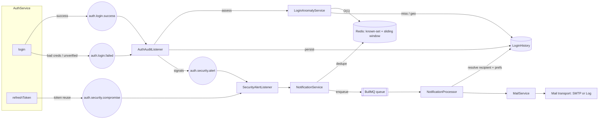
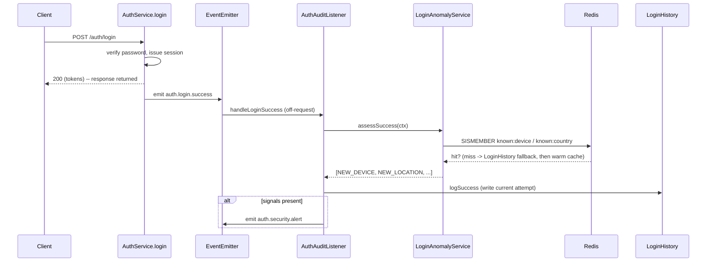
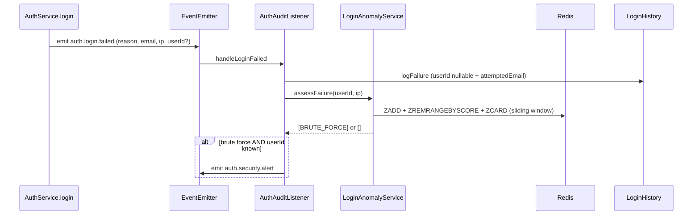
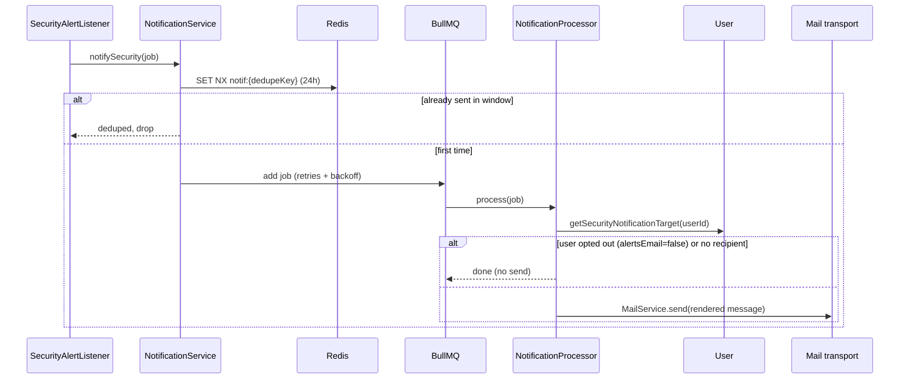
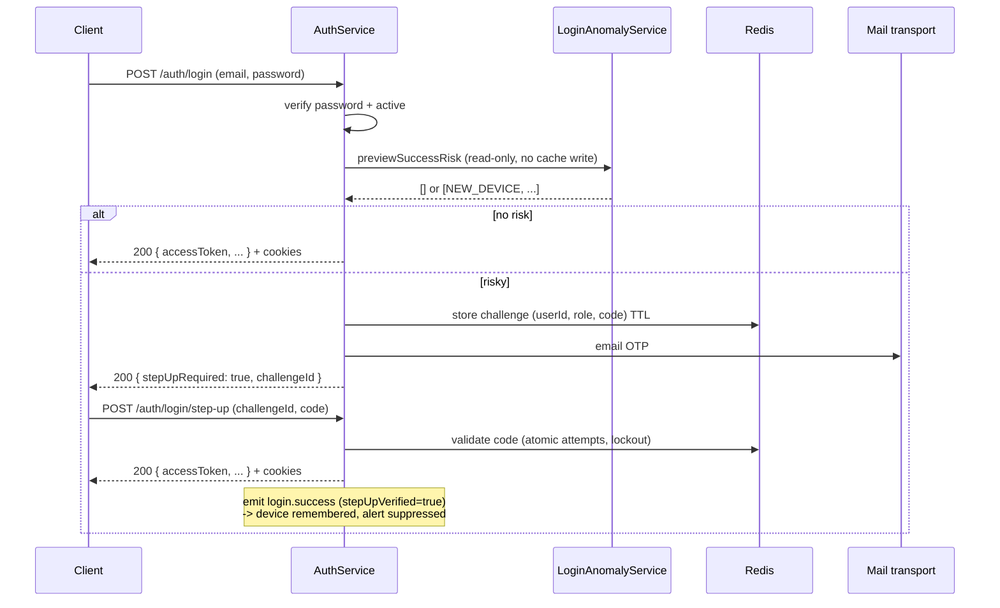

# Security & Login Monitoring

Detection and notification for suspicious authentication activity -- new device,
new country, impossible travel, brute force, and refresh-token reuse. This
document describes the design, the data model, the event flow, the delivery
pipeline, and the scaling characteristics.

## Status

| Phase | Scope                                                           | Status      |
| ----- | --------------------------------------------------------------- | ----------- |
| **1** | Failure logging + anomaly detection + structured alert logs     | Implemented |
| **2** | Notification pipeline (dedupe, user prefs, pluggable transport) | Implemented |
| **3** | Durable delivery queue (BullMQ on Redis) + SMTP transport       | Implemented |

All three phases are implemented. The only production step left is supplying
real SMTP credentials (`SMTP_HOST`, ...) -- without them the pipeline runs
end-to-end using a log-only transport.

## Principles

1. **Separate concerns** -- _detect_ (auth-specific) then _decide/notify_
   (channel-agnostic) then _deliver_ (transport). Each is independently testable
   and swappable.
2. **Never block login** -- detection and delivery run off an emitted event,
   after the HTTP response. A failure in monitoring can never fail auth.
3. **Cheap at volume** -- brute-force counting is a Redis sliding window (not a
   growing `count(*)`), "known device/country" is an O(1) Redis set lookup, and
   delivery is offloaded to a durable BullMQ queue so the request-adjacent path
   only dedupes and enqueues.
4. **Enumeration-safe** -- failed attempts for unknown emails are recorded for
   IP-based brute-force detection but never trigger a notification, which would
   leak whether an email is registered.

## Architecture



### Success path (detection ordering)

Detection must run **before** the current attempt is written, otherwise "new
device / new country" would match the row just inserted.



### Failure path



### Delivery path



## Detection rules

Computed by
[`LoginAnomalyService`](../src/features/auth/services/login-anomaly.service.ts).

| Signal              | Trigger                                                    | On      | Backing store           |
| ------------------- | ---------------------------------------------------------- | ------- | ----------------------- |
| `NEW_DEVICE`        | device fingerprint never seen in a successful login        | success | Redis set (DB fallback) |
| `NEW_LOCATION`      | GeoIP country never seen in a successful login             | success | Redis set (DB fallback) |
| `IMPOSSIBLE_TRAVEL` | last geo-tagged login implies > 900 km/h (min 50 km apart) | success | LoginHistory            |
| `BRUTE_FORCE`       | >= 5 failures for the user or IP within 15 minutes         | failure | Redis sliding window    |

Thresholds (`BRUTE_FORCE_THRESHOLD`, `BRUTE_FORCE_WINDOW_SECONDS`,
`MAX_TRAVEL_KMH`) are constants in the service and can be promoted to config
when tuning is needed.

> The device fingerprint is the same `userId:browser:os` hash used for token
> binding. Geo is deliberately not part of the binding hash (so network changes
> don't force re-login), but it is recorded and used for `NEW_LOCATION` /
> `IMPOSSIBLE_TRAVEL`.

## Events

| Event                      | Emitted by          | Payload                                 | Handled by              |
| -------------------------- | ------------------- | --------------------------------------- | ----------------------- |
| `auth.login.success`       | `login()`           | userId, ip, ua, deviceFingerprint, geo  | `AuthAuditListener`     |
| `auth.login.failed`        | `login()`           | reason, attemptedEmail, ip, ua, userId? | `AuthAuditListener`     |
| `auth.security.alert`      | `AuthAuditListener` | userId, signals[], context              | `SecurityAlertListener` |
| `auth.security.compromise` | `refreshToken()`    | userId, ip, ua                          | `SecurityAlertListener` |
| `auth.stepup.verified`     | `verifyStepUp()`    | userId, ip, country                     | `SecurityAlertListener` |
| `auth.stepup.blocked`      | `verifyStepUp()`    | userId, ip, country                     | `SecurityAlertListener` |

Notification kinds and when they email the owner:

| Kind                 | Trigger                                 | Message                         |
| -------------------- | --------------------------------------- | ------------------------------- |
| `SUSPICIOUS_LOGIN`   | brute force (failed logins)             | "new sign-in activity"          |
| `NEW_SIGN_IN`        | risky login **passed** the OTP          | "New sign-in to your account"   |
| `STEP_UP_BLOCKED`    | risky login **failed** the OTP (voided) | "a sign-in attempt was blocked" |
| `SESSION_COMPROMISE` | refresh-token reuse                     | "unusual session activity"      |

This mirrors the consumer-platform model: a risky sign-in is **challenged**
(email OTP) and the owner is **notified** either way — confirmed on success, or
warned that a password-correct attempt was blocked on failure. New-sign-in and
blocked notifications dedupe per location (24h).

Event names are centralized in
[`events/index.ts`](../src/features/auth/events/index.ts) as `AUTH_EVENTS`.

## Risk-based step-up (email OTP)

A correct password is not enough when the sign-in looks risky. After the
password check, `login()` runs a read-only risk preview; if it returns any of
`NEW_DEVICE` / `NEW_LOCATION` / `IMPOSSIBLE_TRAVEL`, **no session is issued** --
the user must confirm an emailed OTP first. This protects accounts even when the
user has not enabled 2FA (the model many consumer platforms use).



Notes:

- The step-up-verified login is emitted with `stepUpVerified=true`, so the audit
  listener records the device (trusted next time) and suppresses the raw
  "suspicious login" alert -- but a dedicated **`NEW_SIGN_IN`** notification is
  sent instead ("New sign-in to your account"), covering a socially-engineered
  code.
- If the OTP is failed/voided, a **`STEP_UP_BLOCKED`** notification warns the
  owner that a password-correct sign-in was blocked (the strongest "your
  password may be leaked" signal).
- Trust binds to the **login** device (the challenge stores the login UA/IP), so
  completing the OTP trusts exactly the device that was challenged, regardless of
  which client submitted the code.
- Repeated risky logins reuse one pending challenge per user (`stepup:user:{id}`)
  so varying the User-Agent can't flood the inbox with OTPs.
- The OTP is delivered through the same mail transport as alerts (Mailpit in dev).
- Because "new device" is a trigger, a user's first-ever login is challenged.
  To skip that, seed `known:device:{userId}` at email-verification time (the
  registration device is already trusted); left as a policy choice.

**Endpoints**

| Endpoint                   | Result                                                                          |
| -------------------------- | ------------------------------------------------------------------------------- |
| `POST /auth/login`         | Issues a session, or returns `{ stepUpRequired: true, challengeId }` when risky |
| `POST /auth/login/step-up` | `{ challengeId, code }` -> issues the session on a valid OTP                    |

## Data model

`LoginHistory` (schema `auth`) gained three columns and two indexes
(migration `20260723172419_add_login_history_anomaly_fields`):

| Column              | Type               | Purpose                                                |
| ------------------- | ------------------ | ------------------------------------------------------ |
| `userId`            | `Int?` (was `Int`) | nullable so failures for unknown emails are recordable |
| `attemptedEmail`    | `String?`          | the email tried on a failed attempt                    |
| `deviceFingerprint` | `String?`          | exact device match for `NEW_DEVICE`                    |

Indexes: `@@index([userId, deviceFingerprint])` (device lookups),
`@@index([ipAddress, createdAt])` (IP brute-force windowing).

User preference reuses the existing `UserSettings.alertsEmail` flag (defaults to
true when a user has no settings row).

## Redis keys

| Key                                 | Type   | TTL | Purpose                                     |
| ----------------------------------- | ------ | --- | ------------------------------------------- |
| `known:device:{userId}`             | set    | 90d | seen device fingerprints (new-device cache) |
| `known:country:{userId}`            | set    | 90d | seen countries (new-country cache)          |
| `bruteforce:user:{userId}`          | zset   | 15m | failure sliding window per user             |
| `bruteforce:ip:{ip}`                | zset   | 15m | failure sliding window per IP               |
| `notif:sec:{userId}:{kind}:{scope}` | string | 24h | notification dedupe                         |
| `stepup:challenge:{id}`             | string | 10m | pending step-up login context + OTP         |
| `stepup:attempts:{id}`              | string | 10m | atomic step-up attempt counter              |
| `bull:security-notifications:*`     | bullmq | --  | delivery queue                              |

## Project structure

```
apps/api/src/
├── modules/                             # cross-feature infrastructure
│   ├── mail/
│   │   ├── mail-transport.interface.ts  # MailTransport + MAIL_TRANSPORT token
│   │   ├── transports/
│   │   │   ├── log.transport.ts         # default (no provider needed)
│   │   │   └── smtp.transport.ts        # nodemailer, used when SMTP_HOST set
│   │   ├── mail.service.ts              # façade over the transport
│   │   └── mail.module.ts               # picks transport from config
│   └── notifications/
│       ├── notification.types.ts        # queue name, kinds, job shape
│       ├── notification.templates.ts    # subject/body rendering
│       ├── notification.service.ts      # dedupe + enqueue
│       ├── notification.processor.ts    # BullMQ worker -> resolve + deliver
│       └── notifications.module.ts
└── features/auth/
    ├── events/                          # AUTH_EVENTS + typed event classes
    ├── services/
    │   └── login-anomaly.service.ts     # Redis-backed detection
    ├── listeners/
    │   ├── auth-audit.listener.ts       # log + detect -> emit alert
    │   └── security-alert.listener.ts   # alert/compromise -> NotificationService
    └── auth.service.ts                  # emits success/failed/compromise

packages/db/src/domains/
├── auth/login-history.ts                # log + hasSeenDevice/Country, etc.
└── identity/user/user.ts                # getSecurityNotificationTarget
```

Rationale: anomaly detection is auth-specific, so it lives in `features/auth`.
Mail and notifications are cross-cutting infrastructure, so they live under
`modules/` alongside `redis`, `jwt`, and `i18n`.

## Reliability & anti-noise

- **No email on the request path** -- every outbound email (step-up OTP,
  security notifications, …) is enqueued to a single **mail delivery queue**
  (`mail`) and sent by a worker (`MailProcessor`). The login/step-up request
  returns after a fast enqueue; it never blocks on the mail provider, so a slow
  or rate-limited ESP can't degrade auth throughput.
- **Single delivery choke point** -- the mail worker has bounded `concurrency`
  and a `limiter` (default 50/s) so third-party sends stay within the provider's
  rate limit (tune to Resend/SES). Interactive codes use HIGH `priority` so they
  jump ahead of notifications and still arrive within their TTL.
- **Durable delivery** -- each send is a BullMQ job with `attempts: 5` and
  exponential backoff, so a transient SMTP failure retries instead of dropping.
- **Two-stage for notifications** -- the security-notification queue decides
  _who/whether_ (dedupe + recipient + preference); the mail queue does the
  actual _delivery_. OTP/verification emails skip stage one and enqueue directly.
- **Backpressure** -- the request-adjacent path only dedupes (one Redis op) and
  enqueues; all DB reads (recipient, preference) and the provider call happen in
  workers, decoupled from auth throughput.
- **Dedupe** -- `notif:sec:{userId}:{kind}:{scope}` via `SET NX` with a 24h TTL.
  A suspicious login dedupes per distinct signal set; a compromise dedupes per
  user. Prevents inbox/queue flooding on repeated signals.
- **User preference** -- the worker honors `UserSettings.alertsEmail` before
  sending.

## Configuration

All tunables live in the environment (see `.env.example`).

**Mail transport**

| Env                           | Default                     | Notes                                                      |
| ----------------------------- | --------------------------- | ---------------------------------------------------------- |
| `SMTP_HOST`                   | (unset)                     | when unset, the log transport is used (prints to terminal) |
| `SMTP_PORT`                   | `587`                       |                                                            |
| `SMTP_SECURE`                 | `false`                     | `true` for implicit TLS (465)                              |
| `SMTP_USER` / `SMTP_PASSWORD` | (unset)                     | omit for unauthenticated relays                            |
| `MAIL_FROM`                   | `no-reply@rufieltics.local` | envelope From                                              |

Providers (both plain SMTP, no code change):

- **Development -- Mailpit** (free, local): `SMTP_HOST=localhost`,
  `SMTP_PORT=1025`, `SMTP_SECURE=false`, no auth. View mail at
  `http://localhost:8025`.
- **Production -- Resend**: `SMTP_HOST=smtp.resend.com`, `SMTP_PORT=465`,
  `SMTP_SECURE=true`, `SMTP_USER=resend`, `SMTP_PASSWORD=<re_... API key>`,
  `MAIL_FROM` on a verified domain.

**Detection & step-up tunables**

| Env                               | Default   | Controls                                          |
| --------------------------------- | --------- | ------------------------------------------------- |
| `BRUTE_FORCE_WINDOW_SECONDS`      | `900`     | sliding window for failure counting               |
| `BRUTE_FORCE_THRESHOLD`           | `5`       | failures (per user or IP) that trip `BRUTE_FORCE` |
| `IMPOSSIBLE_TRAVEL_KMH`           | `900`     | speed above which travel is "impossible"          |
| `KNOWN_FACTOR_TTL_SECONDS`        | `7776000` | how long a device/location stays "known" (90d)    |
| `NOTIFICATION_DEDUPE_TTL_SECONDS` | `86400`   | notification dedupe window (24h)                  |
| `VERIFICATION_CODE_TTL_SECONDS`   | `300`     | email verification code lifetime                  |
| `VERIFICATION_MAX_ATTEMPTS`       | `5`       | verification attempts before lockout              |
| `VERIFICATION_LOCKOUT_SECONDS`    | `3600`    | verification lockout duration                     |
| `STEP_UP_CODE_TTL_SECONDS`        | `300`     | step-up OTP lifetime                              |
| `STEP_UP_MAX_ATTEMPTS`            | `5`       | step-up attempts before the challenge is voided   |
| `STEP_UP_CHALLENGE_TTL_SECONDS`   | `600`     | how long a pending step-up challenge lives        |

BullMQ and the Redis caches reuse the existing `REDIS_HOST` / `REDIS_PORT` /
`REDIS_PASSWORD` / `REDIS_DB` connection.

## Scaling notes

The event seam means the execution backend can evolve without touching
`login()` or the detection logic:

- **Hot path stays cheap** -- verify credentials, one Redis check (known device),
  enqueue. No Postgres writes are on the login response path; `LoginHistory`
  writes happen off the emitted event.
- **Brute force is O(log n) in Redis** rather than a `count(*)` over a growing
  audit table.
- **Further headroom** (not yet needed): batch `LoginHistory` inserts in a
  worker, and time-partition / add retention to `LoginHistory` so history stays
  bounded.

## Testing

The full pipeline is observable without a mail provider (log transport):

```bash
# New device -> alert -> queue -> mail transport
# 1. register + verify a user, then log in (first login is always NEW_DEVICE)
# 2. watch the API logs for:
#    [SecurityAlertListener] [SECURITY] Suspicious login for user <id> [NEW_DEVICE]
#    [MailTransport] [MAIL:log] to=<email> subject="Security alert: new sign-in activity"

# Returning device -> NO alert (device cache hit)
#   log in again with the same user/User-Agent; no new alert should appear.

# Brute force -> alert after 5 failures in 15m (mind the 5/min login throttle)
for i in $(seq 5); do
  curl -s -o /dev/null -X POST http://localhost:6001/api/v1/auth/login \
    -H 'Content-Type: application/json' \
    -d '{"email":"known@user.io","password":"wrong"}'
done
# -> [SECURITY] Suspicious login for user <id> [BRUTE_FORCE]

# Redis artifacts
docker exec rufieltics-redis redis-cli KEYS 'known:device:*'
docker exec rufieltics-redis redis-cli ZCARD 'bruteforce:user:<id>'
docker exec rufieltics-redis redis-cli KEYS 'notif:sec:*'

# Audit trail
docker exec rufieltics-postgres psql -U root -d rufieltics_db \
  -c 'SELECT "userId","attemptedEmail","isSuccess",reason,"deviceFingerprint","createdAt" FROM auth."LoginHistory" ORDER BY "createdAt" DESC LIMIT 10;'
```
