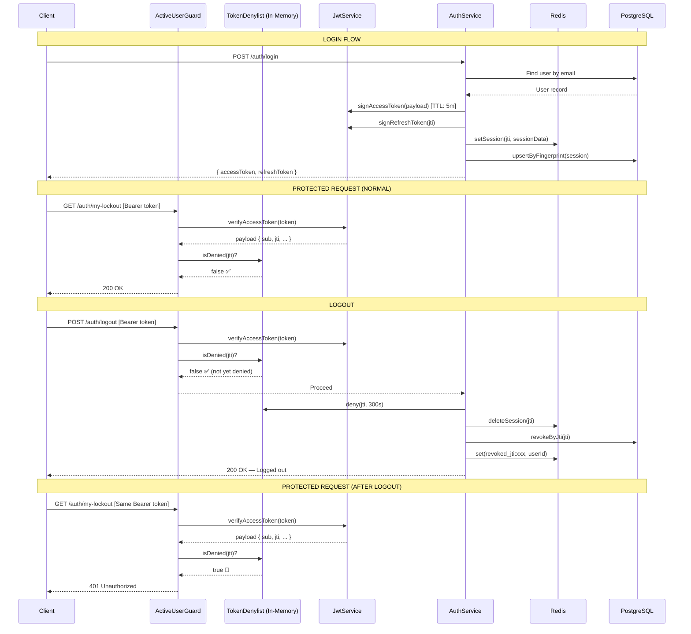
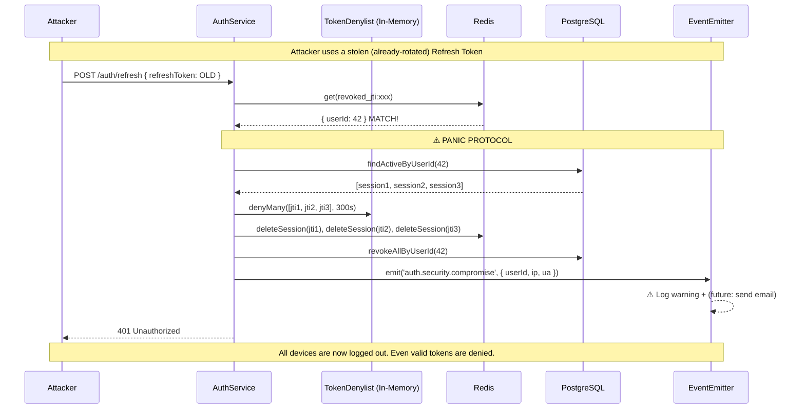
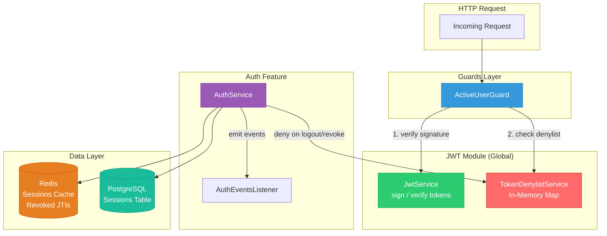

# Access Token Denylist — Architecture Flow

## Token Lifecycle: Login → Request → Logout

## Token Reuse Detection: Compromise Flow

## Component Architecture

## Performance Characteristics

| Operation | Where | Latency | Per-Request Cost |
|-----------|-------|---------|-----------------|
| JWT Verify | CPU (in-process) | ~0.1ms | ✅ None |
| Denylist Check | In-memory Map | ~0.001ms | ✅ None |
| Redis Session Lookup | Network | ~0.5-2ms | ❌ Only on `/refresh` |
| DB Session Lookup | Network | ~2-5ms | ❌ Only on `/refresh` fallback |

> [!TIP]
> The hot path (every protected request) stays **entirely in-process** — JWT signature check + Map lookup. No network I/O at all.
