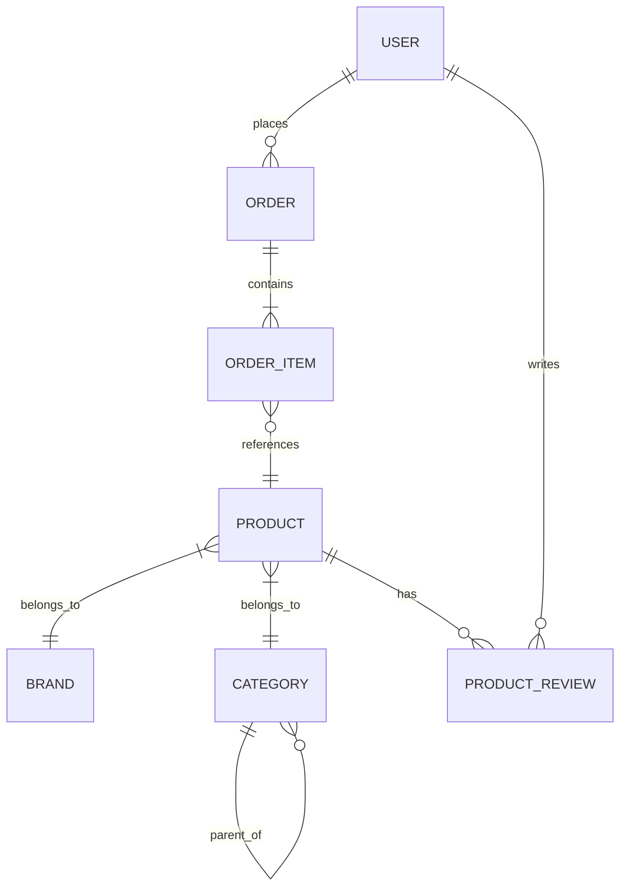
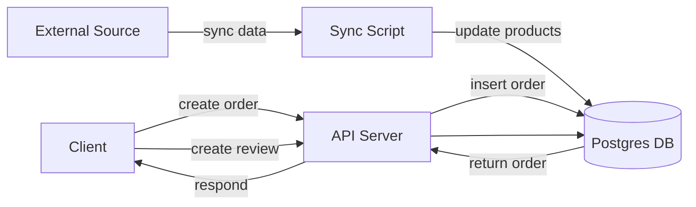

# @rufieltics/db

Database package for Rufieltics application. This package provides database connection and entity repositories for managing data related to users, stores, products, orders, and more.

---

## Features

- Database connection using Prisma ORM
- Entity repositories for core data models
- Utility functions and DB scripts for seeding and synchronization

```bash
pnpm add @rufieltics/db --workspace-root
```

---

## Usage

Import the database connection and entity repositories in your application code:

```typescript
import { createUser } from '@rufieltics/db/entities/user'

async function main() {
  const newUser = await createUser({
    email: 'user@example.com',
    name: 'John Doe',
  })
  console.log('New User:', newUser)
}
main().catch(console.error)
```

---

## Schema & Architecture

This section explains how the database schema (see `prisma/schema.prisma`) maps to an **Entity-Relationship Diagram (ERD)** and a simple **Data Flow Diagram (DFD)** so clients can understand the domain model and the flow of data.

### High-level summary

- **Core entities:** `User`, `Product`, `Order`, `OrderItem`, `Category`, `Brand`, `ProductReview`.
- **Relationships:**
  - A `User` can have many `Order`s and `ProductReview`s.
  - An `Order` contains many `OrderItem`s each `OrderItem` references a `Product`.
  - A `Product` belongs to an optional `Category` and an optional `Brand` and can have many `ProductReview`s and `OrderItem`s.
  - `Category` supports a parent/children hierarchy (self-relation).

> Note: The canonical schema is in `packages/db/prisma/schema.prisma` — this README documents the structure as a guide.

### Entity details (fields & constraints)

- `User`
  - Primary key: `id`
  - Unique: `email`, `username`
  - Timestamps: `createdAt`, `updatedAt`, `lastLogin`
  - Relations: `orders`, `reviews`

- `Product`
  - Primary key: `id`
  - Indexed: `categoryId`, `brandId`, `syncedAt`
  - Fields include: `name`, `price`, `availability`, `rating`, `discount`
  - Relations: `category`, `brand`, `orderItems`, `reviews`

- `Category`
  - Hierarchical: `parentId` → self-relation allows nested categories (`children`)
  - Unique: `name`
  - Relation: `products`

- `Brand`
  - Unique: `name`
  - Relation: `products`

- `Order`
  - Primary key: `id`
  - Enum `status` (`OrderStatus`)
  - Indexed: `status`, `syncedAt`
  - Relation: `items` (OrderItem), optional `user`

- `OrderItem`
  - Composite uniqueness: `[orderId, productId]` (one product per order line)
  - Relations: `order`, `product`

- `ProductReview`
  - Composite uniqueness: `[productId, userId]` (one review per user per product)
  - Foreign key `productId` has `onDelete: Cascade`

---

#### ERD



#### DFD



---

### Data Flow Diagram (DFD) — common flows

1. User checkout flow

- Client → API: create `Order` with `OrderItem`s
- API → DB: insert `Order` and `OrderItem`s calculate and store `totalPrice`
- DB → API: return created `Order`

2. Product synchronization

- External data source → sync script → updates `Product` rows and sets `syncedAt`
- Index on `syncedAt` allows efficient queries for recently-synced products

3. Review flow

- Client → API: create `ProductReview` for `productId` and `userId`
- DB enforces one review per user/product via unique constraint

4. Category management

- Admin → API: create or move `Category` (set `parentId`) → affects product browsing hierarchy

### Notes & best practices

- Use Prisma Client (generated in `packages/db/prisma/generated`) for type-safe DB access.
- Timestamps: `createdAt`, `updatedAt`, and `syncedAt` are important for synchronization and auditing.
- Use the provided indexes and unique constraints to keep queries efficient and data consistent.
- For visual documentation, consider exporting an ERD (e.g., dbdiagram) from the schema or using third-party tools to generate PNG/SVG.

---

## Quick reference

- Schema file: `packages/db/prisma/schema.prisma`
- Generated Prisma client: `packages/db/prisma/generated`
- Useful commands:

```bash
# Generate Prisma client
pnpm --filter @rufieltics/db generate

# Open Prisma Studio
pnpm --filter @rufieltics/db db:studio
```
