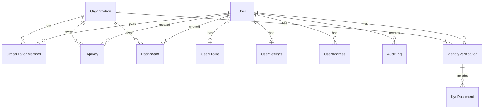
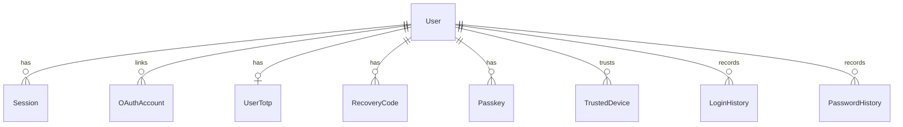
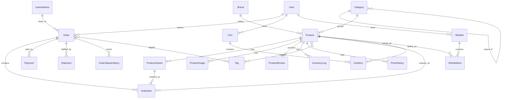
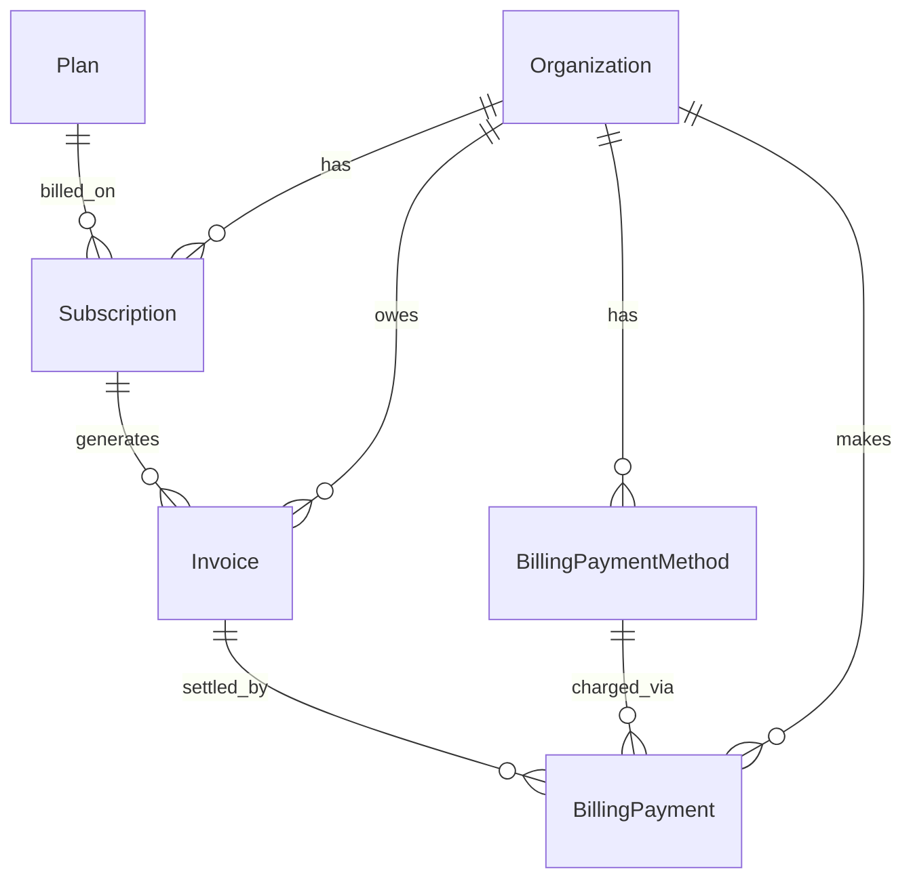
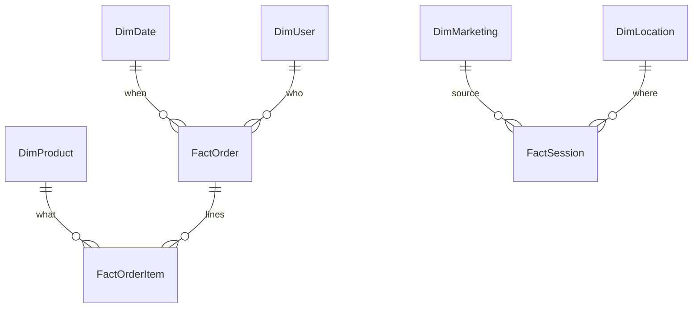

# @rufieltics/db

This package is the data layer for Rufieltics. It holds the Prisma schema, the generated client, and a set of domain functions that the API and the sync jobs call instead of writing raw queries. Keeping the schema and the access functions together means every app reads and writes data the same way.

## What it covers

The schema is split into a few areas so each part stays readable.

- Identity and auth. Users, sessions, passkeys, two factor secrets, recovery codes, trusted devices, and login history.
- Store connections. The provider accounts a business links, such as a Shopify store or an ad platform, along with the sync state for each one.
- Commerce. The catalog, orders, and fulfillment records that get pulled in from those connections.
- Finance and billing. Subscriptions, invoices, and payment records.
- Analytics. The computed metrics the dashboard reads.

The Prisma schema lives in `prisma/schema/` and is split across several files by area. The matching domain functions live in `src/domains/`, grouped the same way.

## Entity relationships

These diagrams show the main tables and how they relate. They are grouped by area to stay readable. The schema is the source of truth, so treat these as a map rather than a full column list.

### Accounts and access


```mermaid
erDiagram
  Organization ||--o{ OrganizationMember : has
  User ||--o{ OrganizationMember : joins
  Organization ||--o{ ApiKey : owns
  User ||--o{ ApiKey : created
  Organization ||--o{ Dashboard : owns
  User ||--o{ Dashboard : created
  User ||--o| UserProfile : has
  User ||--o| UserSettings : has
  User ||--o{ UserAddress : has
  User ||--o{ AuditLog : records
  Organization ||--o{ IdentityVerification : has
  User ||--o{ IdentityVerification : has
  IdentityVerification ||--o{ KycDocument : includes
```

### Auth and security


```mermaid
erDiagram
  User ||--o{ Session : has
  User ||--o{ OAuthAccount : links
  User ||--o| UserTotp : has
  User ||--o{ RecoveryCode : has
  User ||--o{ Passkey : has
  User ||--o{ TrustedDevice : trusts
  User ||--o{ LoginHistory : records
  User ||--o{ PasswordHistory : records
```

### Commerce


```mermaid
erDiagram
  Category ||--o{ Category : "parent of"
  Category ||--o{ Product : groups
  Brand ||--o{ Product : makes
  Product ||--o{ ProductVariant : has
  Product ||--o{ ProductImage : has
  Product ||--o{ ProductReview : receives
  Product ||--o{ InventoryLog : logs
  Product ||--o{ PriceHistory : logs
  Product }o--o{ Tag : tagged
  User ||--o{ Order : places
  UserAddress ||--o{ Order : ships_to
  Order ||--o{ OrderItem : contains
  Product ||--o{ OrderItem : ordered_as
  ProductVariant ||--o{ OrderItem : ordered_as
  Order ||--o{ Payment : paid_by
  Order ||--o{ Shipment : fulfilled_by
  Order ||--o{ OrderStatusHistory : tracks
  Order }o--o{ Tag : tagged
  User ||--o{ Cart : owns
  Cart ||--o{ CartItem : contains
  Product ||--o{ CartItem : added_as
  User ||--o{ Wishlist : owns
  Wishlist ||--o{ WishlistItem : contains
  Product ||--o{ WishlistItem : saved_as
```

### Billing


```mermaid
erDiagram
  Organization ||--o{ Subscription : has
  Plan ||--o{ Subscription : billed_on
  Subscription ||--o{ Invoice : generates
  Organization ||--o{ Invoice : owes
  Organization ||--o{ BillingPaymentMethod : has
  Invoice ||--o{ BillingPayment : settled_by
  Organization ||--o{ BillingPayment : makes
  BillingPaymentMethod ||--o{ BillingPayment : charged_via
```

### Analytics

The analytics area is a star schema for reporting. Fact tables such as `FactOrder`, `FactOrderItem`, `FactPayment`, `FactShipment`, `FactSession`, `FactPageview`, `FactSearch`, `FactCartActivity`, and `FactReview` hold the events. Dimension tables such as `DimDate`, `DimUser`, `DimProduct`, `DimMarketing`, and `DimLocation` hold the context. Aggregate tables such as `AggDailyStats` and `AggProductPerformance` hold rolled up numbers for fast reads.

Facts join to dimensions on surrogate keys rather than enforced foreign keys, which is normal for a warehouse style layout, so those links do not appear as Prisma relations.


```mermaid
erDiagram
  DimDate ||--o{ FactOrder : when
  DimUser ||--o{ FactOrder : who
  DimProduct ||--o{ FactOrderItem : what
  DimMarketing ||--o{ FactSession : source
  DimLocation ||--o{ FactSession : where
  FactOrder ||--o{ FactOrderItem : lines
```

## Usage

Import the function you need from its domain and call it. The functions return typed results straight from Prisma.

```typescript
import { getUserByEmail } from '@rufieltics/db/domains/identity/user'

const user = await getUserByEmail('owner@example.com')
```

## Working with the schema

```bash
# generate the Prisma client after a schema change
pnpm --filter @rufieltics/db generate

# create and apply a migration in development
pnpm --filter @rufieltics/db migrate:dev

# browse the data
pnpm --filter @rufieltics/db studio
```

Migrations are checked into `prisma/migrations/`. Run `migrate:dev` after editing the schema so your local database and the generated client stay in step.
